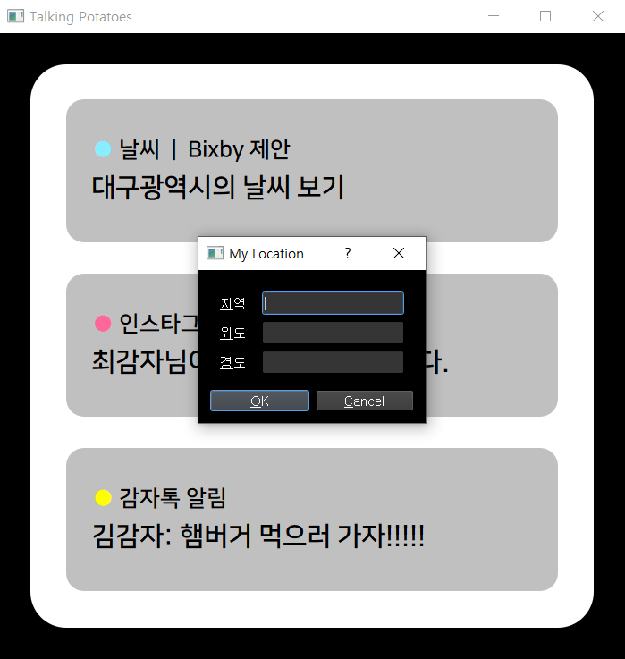
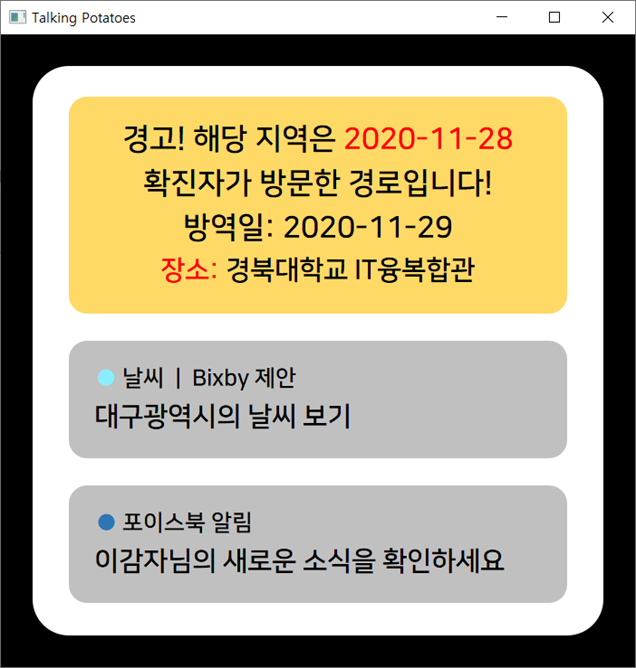
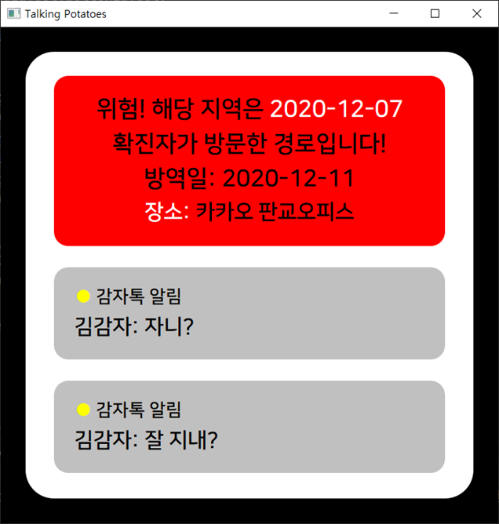

# covid-19-notification

## 1. 개요 (Introduction)

미소재단 4차 산업 아이디어 공모전 2차에 제출하기 위한 토킹 포테이토팀의 (Team Talking Potates) 프로젝트이다.

2019년 12월부터 시작한 코로나19로 인해 확진자의 동선 파악에 대한 중요성이 대두되고 있다.

확진자가 다녀간 **동선의 좌표(위도, 경도)**를 db에 넣어, 사용자의 현재 위치와의 거리를 계산해서 **반경 500m 이내**일 경우 스마트 워치에 알림을 띄운다

- 방역일 **7일 이내**: 빨간 알림
- 방역일 **7일 ~ 14일 이내**: 노란 알림

*원래는 gps 모듈을 이용해서 실시간으로 위치를 받아와야 하지만, gps 모듈이 없는 관계로 dialog를 띄워서 현재 위치를 직접 입력하도록 하였다.

Due to COVID-19 pandemic starting from December 2019, the importance of identifying the routes of confirmed patients has been raised.

We put the **coordinates (latitude, longitude)** of the place vistied by confirmed patients in Database, calculate the distance from the current location of user, and make notification to smart watch if it is **within 500m**.

- Quarantine within **7 days**: Red Notification
- Quarantine within **7~14 days**: Yellow notification

Originally, the location was to be obtained in real time using GPS module, but since there was no GPS module, we made dialog to enter the current location of user directly.

## 2. 프로젝트 환경 (Project Environment)

- 사용 OS: Window
- 개발 Tool: pycharm
- 사용 언어: Python
- UI: PyQt5
- DB: sqlite
- Distance Calculation: haversine

----

#### - MainUI.py

: PyQt5를 이용해서 UI 구현

: Implemented UI with PyQt5

#### - DBManager.py

: sqlite3 패키지를 이용해서 DB 연동.

: Linked DB using sqlite3

#### - Calculator.py

: 좌표를 이용해서 거리 계산, 날짜 계산

: Calculate distance with coordinate, and calculate days

## 3. 사용법

"MainUI.py" 파일을 실행한다

execute "MainUI.py"

- 메인 화면

enter 키를 누른다

press enter key

- Dialog

지역, 위도, 경도를 입력한다.

*db에는 서울, 대구, 울산, 인천, 대전, 제주만 들어있어서, 해당 지역만 입력해야한다.

Inputs: region, latitude, longitude

there are only 서울, 대구, 울산, 인천, 대전, 제주 in the Database, so only these are available. (no exception handling)

- 노란 알림(yellow warning)

- 빨간 알림(yellow warning)

